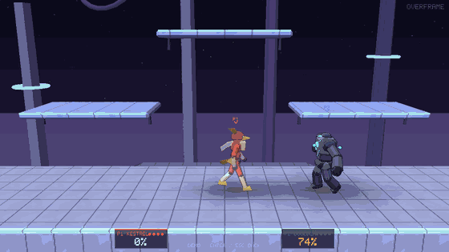
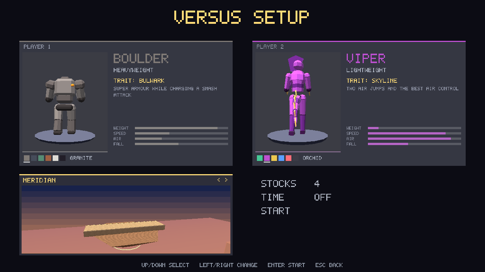
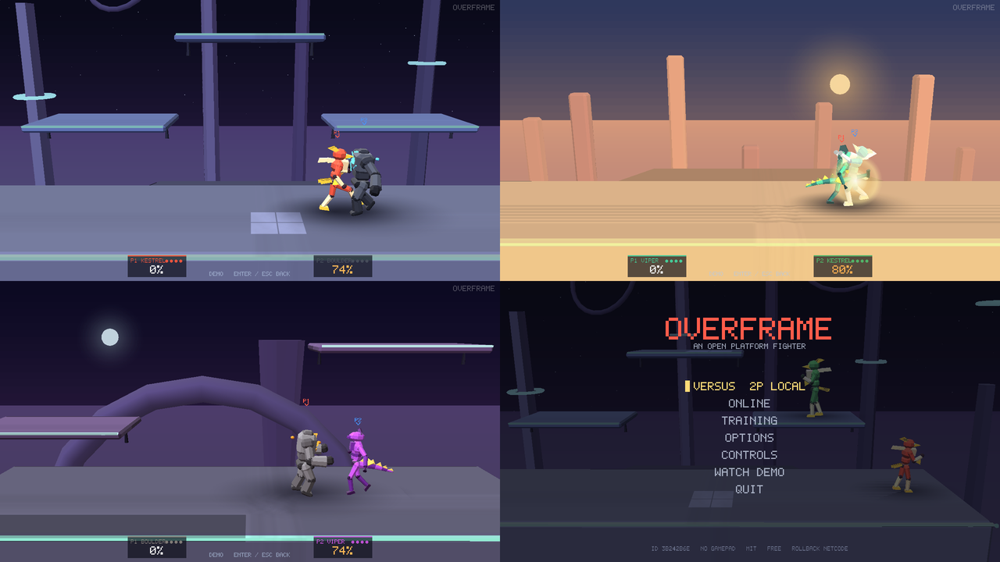
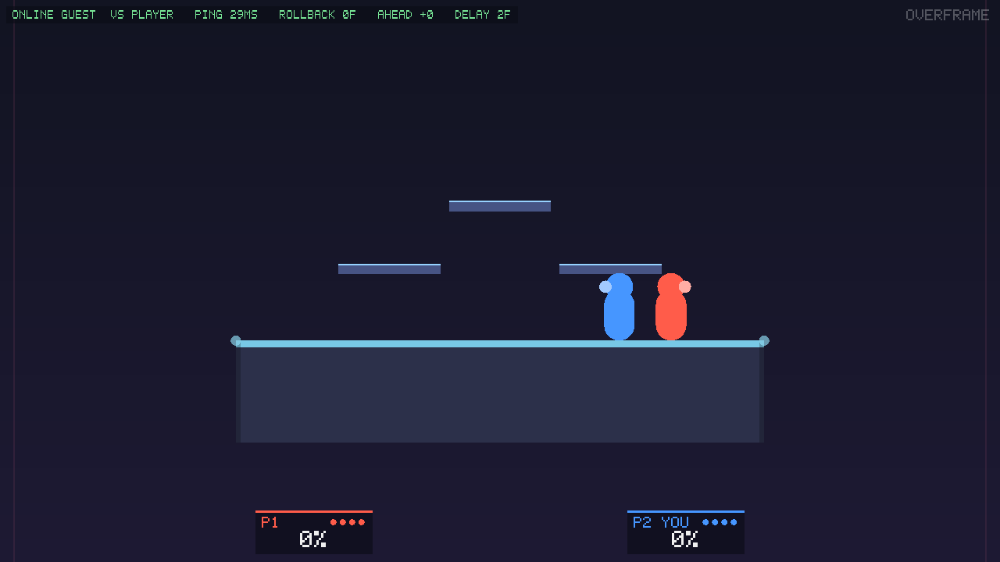

# OVERFRAME

**An open, tournament-ready platform fighter.** Fast, precise, rollback-ready — and 100% original, free, and MIT-licensed.







*The clip above is the actual game engine playing its scripted demo (not a pre-baked animation): dash-dance → wavedash → walk-in → tilt → forward smash → KO, rendered by the 3D renderer.*

[](https://github.com/Gisleno-bit/overframe/actions/workflows/ci.yml)
&nbsp;License: MIT &nbsp;•&nbsp; Language: Rust &nbsp;•&nbsp; Status: **Fase 3 (in progress) — reference-calibrated game feel, 3D models & stages, roster, online lobbies**

---

## What this is

OVERFRAME is a platform fighter that reproduces the *feel* of classic competitive platform fighting — the movement, the spacing game, the tech skill — as a game the community can own and run at tournaments **without any legal risk**. To make that possible, everything shippable is original and built from scratch:

- **Original everything** — characters, stage, names, art, sound, and code are all our own. No assets, ROMs, ISOs or decompiled code from any other game are used, referenced, or required.
- **Gameplay mechanics only.** What we borrow is *ideas* — a percent/knockback damage model, recovery mechanics, L-cancelling, wavedashing, teching. Game mechanics and rules are not copyrightable; the assets that express them are. We copy the former and invent the latter. See [`docs/LEGAL.md`](docs/LEGAL.md).
- **Free & open source (MIT).** No price, no lock-in. Fork it, host it, mod it.
- **Rollback-ready.** The simulation is deterministic and save/load-able, and it's already wired to [GGRS](https://github.com/gschup/ggrs). A GGRS `SyncTest` runs in CI and proves the engine is rollback-safe.

The build ships a **3-fighter roster** across the classic archetypes and **3
stages**:

| Fighter | Archetype | Signature trait |
|---|---|---|
| **Kestrel** | Fast-faller | *Momentum* — fastest fall speed, longest wavedash |
| **Boulder** | Heavyweight | *Bulwark* — super armour while charging a smash |
| **Viper** | Lightweight | *Skyline* — two air jumps, best air control |

Stages: **The Lattice** (floating-platform standard, a violet void of pylons
and rings), **Meridian** (flat neutral, a desert arena at dawn), **Tidegate**
(asymmetric, a basalt sea gate under the moon). Characters, stages, names,
colours and frame data are all original.

**Everything is rendered in 3D** by the game's own renderer: each fighter is
an original low-poly *segmented* model (rigid parts on a bone hierarchy) with
six colour palettes, toon lighting and outlines, soft shadows, particles and a
tournament-style camera. Animation is **procedural and driven by the
simulation's frame data** — a move winds up during its startup, snaps to the
strike pose on its first active frame with the limb aimed at the hitbox, and
recovers during endlag — so what you see is exactly what hits. Artists can
replace any model with a Blender-made `.glb` without touching code
([`docs/ART_PIPELINE.md`](docs/ART_PIPELINE.md)); a classic 2D view remains
available in Options.

## How it feels (and why)

The combat engine is calibrated against the public frame data of the classic competitive platform fighter — *behaviour and formulas only*, no assets, no data files:

- **Impact**: hitlag `⌊damage/3 + 3⌋` freezes both fighters (×1.5 electric, ×2/3 crouch-cancelled, cap 20); knockback uses the well-known percent × weight formula, launches at `0.03 × kb` and decays uniformly; hitstun is `0.4 × kb`; weak hits *shove* grounded victims along the floor, strong ones tumble. **DI**, **SDI** and **ASDI** happen *during* the freeze.
- **Response**: 3-frame jump-squats, per-character dash-dance windows, fast-falls, 4-frame landings, L-cancel and autocancel, 49-frame helpless air-dodges (wavedashing is a commitment), 15-frame shield drop, powershield, additive shieldstun.
- **Feedback**: every hit is a *tap / thud / crack* (procedurally synthesised — no audio files), a hit-frame flash, a rattle, impact lines, a scaled camera shake and controller rumble. All of it is a pure function of the simulation, so rollbacks never double-fire.

Every number, its reference, the diagnosis of what was wrong before, and how to measure it is in [`docs/GAME_FEEL.md`](docs/GAME_FEEL.md); `tests/feel.rs` pins the rules.

## Is this legal? (short version)

Yes. Copyright protects a game's *expression* (its art, music, characters, story, code), not its *ideas, rules, systems or mechanics*. Games like *Rivals of Aether*, *Brawlhalla*, *Fraymakers* and *Slap City* all recreate this genre's mechanics and have never had a problem, because they built their own assets. OVERFRAME follows the same, well-trodden path — and goes further by being open-source and free. The full reasoning, and the "clean-room" rules every contributor follows, is in [`docs/LEGAL.md`](docs/LEGAL.md). (This is not legal advice.)

## Play it

### Option A — download a build (no tools needed)

Grab the latest build for your OS from the [**Releases**](https://github.com/Gisleno-bit/overframe/releases) page:

- **Windows** → `overframe-windows-x86_64.zip` → unzip → run **`overframe.exe`**.
- **macOS** → `overframe-macos-arm64.tar.gz`.
- **Linux** → `overframe-linux-x86_64.tar.gz`.

These binaries are built automatically on a real Windows/macOS/Linux machine by [GitHub Actions](.github/workflows/release.yml) whenever a `vX.Y.Z` tag is pushed — so the Windows `.exe` is a genuine native Windows build.

### Option B — build it yourself (one command)

You need the [Rust toolchain](https://rustup.rs) (`rustup`). Then:

```bash
cargo run --release
```

On **Windows** that produces and runs `target\release\overframe.exe` — a standalone GUI executable, exactly what you want.
On **Linux** you also need the usual game dev libraries once:

```bash
sudo apt-get install -y libx11-dev libxi-dev libgl1-mesa-dev libasound2-dev libudev-dev
```

> **Why isn't a prebuilt `.exe` committed to the repo?** Shipping binaries in Git is bad practice (they bloat history and can't be audited). Instead, the exact same `.exe` is produced reproducibly by CI and attached to each Release — that's the standard, trustworthy way open-source games distribute executables.

## Controls

Two players share one keyboard, and any connected **gamepad** works too (first pad = P1, second = P2; keyboard and pad are merged, so either drives the fighter).

| Action    | Player 1        | Player 2          |
|-----------|-----------------|-------------------|
| Move      | `W A S D`       | Arrow keys        |
| C-stick   | `Q E R F`       | `I J K L`         |
| Jump      | `Space`         | `Right Shift`     |
| Attack    | `C`             | `.`               |
| Special   | `V`             | `/`               |
| Shield    | `Left Shift`    | `Right Ctrl`      |
| Grab      | `X`             | `,`               |

**Gamepad (default layout, rebindable in Options)**

| Action  | Buttons                         |
|---------|---------------------------------|
| Stick / C-stick | Left stick / Right stick |
| Attack  | A (South)                       |
| Special | B (East)                        |
| Jump    | Y (North) or X (West)           |
| Shield  | LT, RT (analog triggers) or LB  |
| Grab    | RB                              |

Gamepads are read with [`gilrs`](https://gitlab.com/gilrs-project/gilrs): XInput on Windows (Xbox pads and anything Steam/other drivers expose as XInput, e.g. a Switch Pro controller through Steam), evdev on Linux, IOKit on macOS. Rebind any action in **Options** (select the row, press Enter, press the button); bindings, input delay and the host port persist in the settings file (path shown at the bottom of the Options screen).

**Tech reference**

- **Tilt / smash** — Attack + a *held* stick direction is a tilt; a **C-stick** flick is a smash.
- **Short hop** — tap jump; **full hop** — hold it.
- **Fast fall** — flick down while descending.
- **Wavedash** — jump, then air-dodge (Shield) diagonally down-into the ground; you slide. An air-dodge that doesn't land leaves you **helpless**.
- **L-cancel** — press Shield in the last few frames before landing an aerial to halve its landing lag; landing outside the hit window **autocancels** to 4 frames.
- **DI / SDI** — hold the stick during the freeze frames to bend the launch; *tap* it to nudge yourself out of multi-hits. **Crouch-cancel** weak pokes by crouching.
- **Shield** — powershield in the first 2 frames; dropping it costs 15 frames unless you jump, grab or up-smash out of it.
- **Grab** — Z standing (frame 7) or out of a dash (frame 12, slides). While holding: **stick / C-stick** throws, **Attack / Z** pummels; the victim mashes out faster at low percent.
- **Ledge** — 7-frame catch with intangibility you keep if you let go; **Jump / up** ledge jump (committed), **Attack** ledge attack, **Shield** ledge roll, **toward the stage** getup, **down / away** let go. Everything is slower at 100 %+.
- **Ledge, roll, spot-dodge, air-dodge, tech** — all present. See the in-game **Controls** screen, [`docs/DESIGN.md`](docs/DESIGN.md) and the numbers in [`docs/GAME_FEEL.md`](docs/GAME_FEEL.md).

Menu: **Versus** (2P local, with character/stage select and match rules), **Online** (host / join with a LAN room browser and lobby), **Training** (character + stage, hit/hurtbox display — `Tab` toggle, `Backspace` reset), **Options** (input delay, port, SFX volume, rumble, renderer, gamepad rebinding), **Controls**.

## Play online



Online play is **peer-to-peer rollback** (GGRS) over a single UDP port — no account, no server, no matchmaking service.

1. **Host** → *Online → Host game*. You land in a **lobby** with a **room code**
   (e.g. `R0004-0GYF8`). The host sets the stage, stocks and time.
2. **Join** → *Online → Join game*. **LAN rooms appear automatically** in the
   browser; pick one, or type a room code / `ip:port`. Optional room password.
3. In the lobby both players pick **character + palette**, **chat**, and press
   **Ready**. When both are ready the host starts; GGRS synchronises and the
   match begins. The top-left HUD shows **ping**, **rollback frames**, how many
   frames you are **ahead**, and the **input delay**.

| Situation | What to do |
|---|---|
| **Same LAN** | Share the room code as shown. Done. |
| **Internet** | The host forwards **UDP port 7777** (or the port set in Options) on their router to their PC, then shares their **public IP** + port (`203.0.113.9:7777`) — or a room code built from it. UPnP auto-forwarding is on the roadmap; for now it's a manual router rule. |
| **Two instances on one PC (testing)** | `overframe --host 7801` and `overframe --join 127.0.0.1:7801`. Use a different settings dir per instance so they get different ids: `OVERFRAME_CONFIG_DIR=/tmp/a` / `OVERFRAME_CONFIG_DIR=/tmp/b` (on Windows PowerShell: `$env:OVERFRAME_CONFIG_DIR="C:\tmp\a"`). |

Command-line shortcuts: `overframe --host [port]`, `overframe --join <code|ip:port>`.

**Input delay.** Default 2 frames (≈33 ms of local delay traded for shorter rollbacks). Lower it to 1 for LAN, raise to 3–4 on bad connections (*Options → Input delay*). Both sides use the host's setting.

**How it stays in sync.** The simulation is deterministic and save/load-able, so GGRS predicts the remote input, and when the real input arrives a few frames later it rolls back and re-simulates. Desync detection is on (checksums compared every 30 frames); if the engine ever disagreed you'd see a red **DESYNC DETECTED** banner — that is a bug report, not something a player can cause. Two players on the same architecture with the same build never desync; cross-architecture bit-exactness (fixed-point math) is the remaining hardening item.

**Identity.** On first run the game generates a random 64-bit `player_id` (stored in the settings file; no hardware or personal data). It is exchanged in the handshake so tournament organisers can refer to a stable id — the groundwork for the ban list described in [`docs/DESIGN.md`](docs/DESIGN.md#ban-system). A host with a `bans.txt` next to its settings file refuses listed ids.

## How it's built

Three cleanly separated layers, which is what makes the game testable, replayable and (soon) networked:

```
src/
  sim/        Deterministic, engine-agnostic simulation. No rendering, window,
              audio or wall-clock. GameState::step(inputs) -> next tick.
  viz/        Backend-agnostic 2D drawing: a Painter trait + one draw_scene()
              (HUD, menus, the classic 2D view, the headless GIF tool).
  model/      3D content layer, pure CPU: mesh primitives, segmented rigs,
              procedural animation from sim state (anim.rs), the three fighter
              models (characters.rs) and palettes, stage models with per-stage
              looks (stage3d.rs), the match camera, glTF import/export
              (gltf_io.rs) and the assets/ override (assets.rs).
  render/     macroquad front-end: window, menus with 3D previews, options,
              online screens, the fixed-timestep loop, the animation viewer;
              scene3d.rs is the 3D match renderer (lighting baked on the CPU,
              one small outline shader); input.rs merges keyboard + gilrs and
              drives rumble; audio.rs synthesises every sound at start-up.
  netcode/    GGRS rollback: mod.rs (Config, SyncTest, request handling),
              session.rs (host/join state machine on P2PSession), socket.rs
              (one UDP socket for handshake + GGRS), handshake.rs, roomcode.rs,
              banlist.rs.
  gamepad.rs  Pure gamepad → PlayerInput mapping and bindings (unit-tested).
  config.rs   Settings file: player_id, port, input delay, pad bindings.
  headless.rs CPU rasteriser that renders the same scene to a GIF (no GPU/display).
  demo.rs     The scripted showcase match used by the GIF tool and attract mode.
```

Because the simulation is pure and input-driven, the renderer is a *function of the sim state*: the 3D scene, the classic 2D view and the headless GIF all read the same `GameState`, and the **exact same `step`** runs locally and over the network. Render-only state (camera smoothing, eased turns, trails) lives in the renderer and is never saved or rolled back.

### 3D pipeline at a glance

- **Models**: `src/model/characters.rs` builds Kestrel, Boulder and Viper from primitives on a shared humanoid skeleton plus signature extras (crest/scarf/tail feathers, orbiting stones, hood/tail). 1.4–2.5k triangles each.
- **Animation**: `src/model/anim.rs` — stance, walk/run cycles, crouch, jump squash & stretch, air poses, shield, rolls, tumbles, ledge hang, knockdown, throws, and a wind-up → strike → recover timeline for every move driven by its own startup/active/endlag with the striking limb aimed at the hitbox. Per-character secondary motion for the extras.
- **Look**: CPU toon lighting (hemisphere ambient + banded key + fill + rim) with 6 palettes per fighter; per-stage art direction (sky, materials, procedural tiled texture, light); inverted-hull outlines; soft blob shadows; billboard hit/dust/blast effects; strike trails; smooth tournament camera.
- **Artist path**: `overframe --export-glb kestrel k.glb` → model over it in Blender → export `.glb` → drop into `assets/characters/` → the game uses it with the same animation. Import ↔ export round-trips in CI. Check any model with `overframe --anim kestrel`.

### Determinism & rollback

Rollback netcode requires the simulation to be deterministic and perfectly save/load-able. OVERFRAME's `GameState` is a handful of `Vec`s with no external handles; `step` reads only its own fields plus inputs and never touches the clock or a global RNG (the RNG is seeded per match and saved). `tests/determinism.rs` drives the whole thing through a GGRS `SyncTestSession`, which re-simulates every frame from a saved state and compares checksums — if anything drifted, CI would fail.

> The simulation currently uses `f32`, which is bit-reproducible for two players on the same architecture running the same binary (the normal case). Cross-architecture bit-determinism (fixed-point math) is a documented Fase-2 hardening task; the math is isolated in `src/sim/math.rs` so the change is contained.

## Testing

```bash
# Fast, no system deps: physics/property tests + rollback determinism
cargo test --no-default-features --features netcode

# Everything (also links the GUI)
cargo test
```

Handy flags while working on visuals:

```bash
overframe --versus kestrel,viper,tidegate      # straight into a local match
overframe --demo boulder,kestrel,meridian      # attract-mode demo
overframe --anim viper                         # animation viewer (every state and move)
overframe --demo --screenshot shot.png --at 90 # save a frame and quit
overframe --demo --record frames 60 300        # save 300 frames for a GIF
overframe --export-glb kestrel kestrel.glb     # rig for Blender
```

`tests/feel.rs` pins the impact and response rules (hitlag by damage, grounded flinch, uniform knockback decay, crouch cancel, SDI, shieldstun and pushback, powershield, shield drop, helpless air-dodge, landing lag / L-cancel / autocancel, late hits, dash-attack momentum, run speed across the stage, per-character dash-dance, swept hitboxes) and `tests/grab_ledge.rs` the grab and ledge rules (grab windows, hold formula and mash-out, pummel, throws, ledge catch / intangibility / hang time, fresh and tired getup options, committed ledge jump). `tests/mechanics.rs` asserts the *relationships* that make it feel right — a full hop clears a short hop, fast-falling lands sooner, dashing outruns walking, an angled air-dodge wavedashes, L-cancel cuts landing lag, knockback grows with percent, and the sim is deterministic. `tests/determinism.rs` is the GGRS `SyncTest` rollback check.

`tests/content.rs` checks every character has a complete, sane moveset and a genuinely distinct archetype, and that stages are well-formed. The `model` module carries its own unit tests (closed, outward-facing primitives; bone hierarchy maths; strike poses aim where the hitbox is; gait cycles are periodic; every fighter model fits its collision size; stage models sit on the sim's platforms; camera framing; glTF export → import round trip of every fighter). `tests/netcode_flow.rs` covers the online layer end to end: room-code and handshake round-trips, the ban-list format, and — the important one — **a real host and guest connecting over loopback UDP, synchronising through GGRS, playing 300 frames with deliberately uneven pacing so rollbacks actually happen, and finishing on byte-identical states**. It also checks that a banned id is refused. `tests/gamepad_map.rs` covers the gamepad mapping, deadzones, rebinding and persistence without hardware.

## Roadmap

- **Fase 1 — prototype (this repo).** One fighter, one stage, full movement tech, knockback/percent/stocks, shields/rolls/ledges, local 2-player, training mode with hitbox display, deterministic rollback-ready core. ✅
- **Fase 2 — online (this release).** GGRS P2P rollback netcode over direct UDP with room codes, host/join UI, live ping/rollback HUD, gamepad support with in-game rebinding, persistent player identity and the ban-list data format. ✅ Still open from Fase 2: fixed-point determinism hardening (see below).
- **Fase 3 — content + Steam (in progress).** 3 fighters across archetypes, 3
  stages, character/stage select, match rules (stocks/time), LAN lobbies with a
  room browser + chat, Steam-ID-ready ban list ✅. **Original 3D models,
  procedural animation, 3D stages, toon look and the Blender `.glb` pipeline**
  ✅. **Reference-calibrated game feel** — hitlag, knockback, DI/SDI, shield
  rules, dodge and landing timings, sound and rumble ✅ (this release).
  Remaining: more fighters/stages toward 8-10, artist-made models through the
  pipeline, and the Steam integration (matchmaking, invites, SDR transport)
  planned in `docs/STEAM.md`.
- **Fase 4 — launch.** Ship free on Steam (Early Access); community tournament
  support.

## Contributing

PRs welcome — see [`CONTRIBUTING.md`](CONTRIBUTING.md), especially the **clean-room rule**: never copy assets, data or code from another game, and don't add "reference" values pulled from another game's files. Mechanics from public community documentation (how a mechanic behaves) are fine; assets and data are not.

## License

[MIT](LICENSE). Original work by the OVERFRAME contributors. OVERFRAME is a homage built for the community; it is not affiliated with, endorsed by, or derived from any other game or company.
